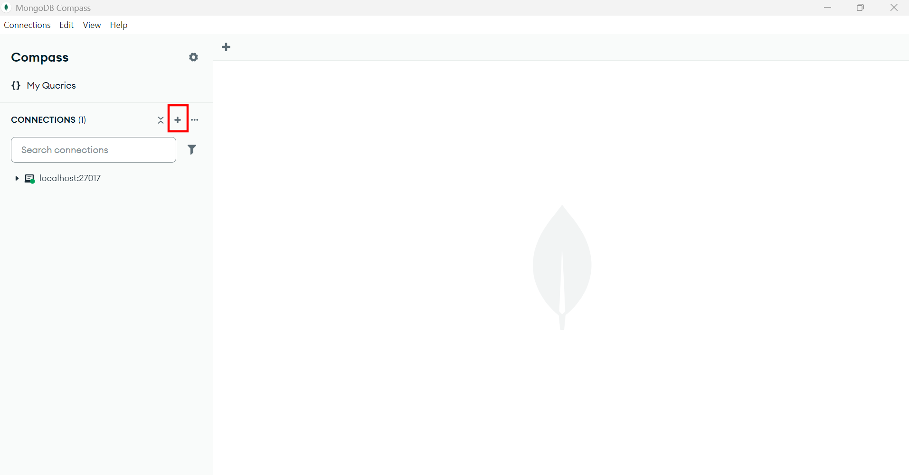
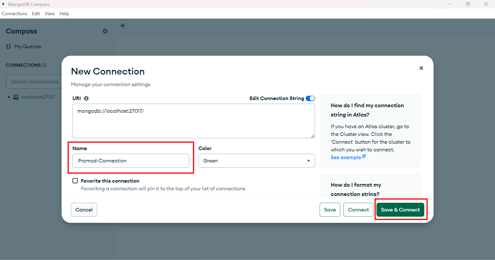
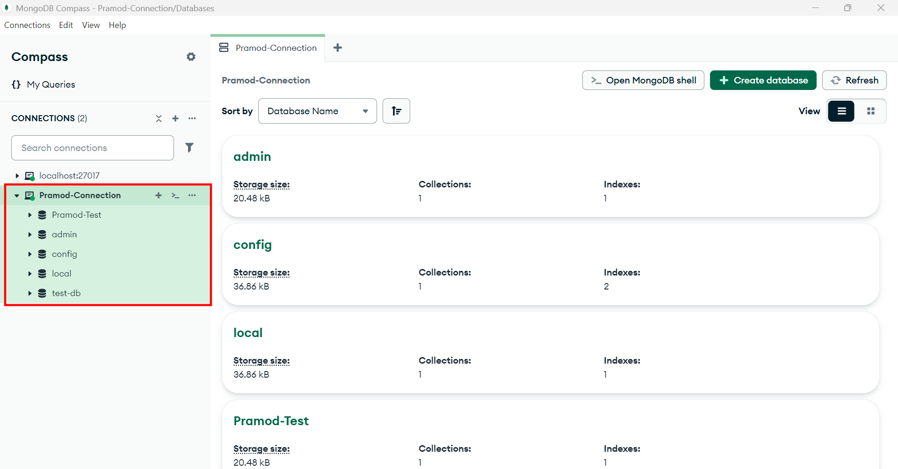
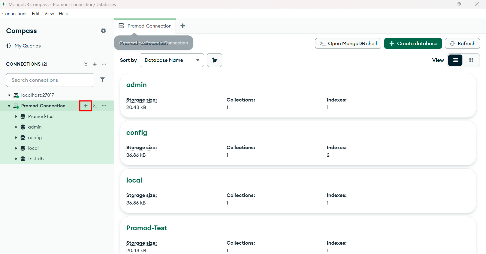
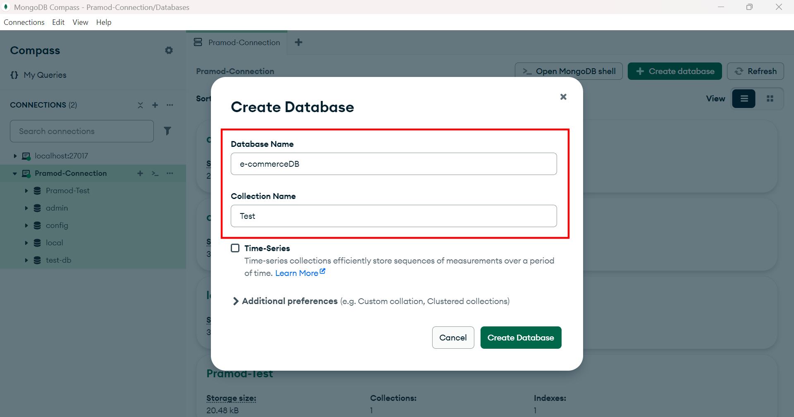
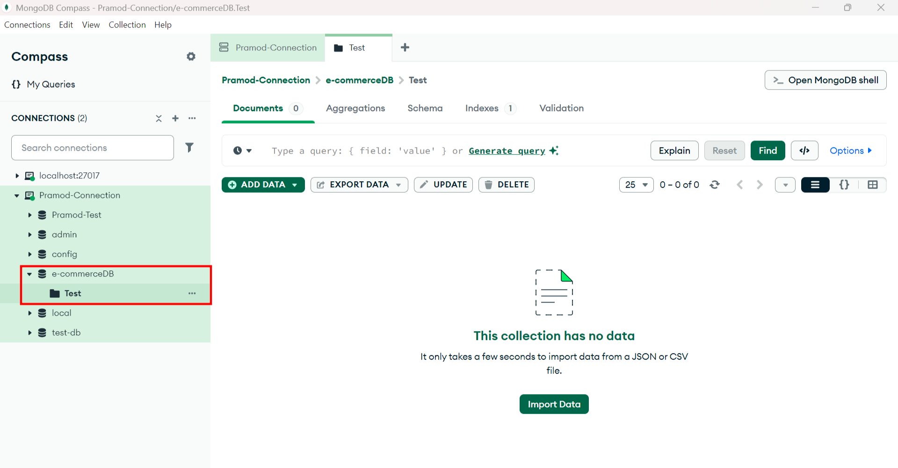

# 🗄️ MongoDB + Mongoose: In-Depth Workshop Guide

## 📌 What is MongoDB?
MongoDB is a **NoSQL document database** that stores data in **flexible, JSON-like documents**.

- Stores data as **BSON** (Binary JSON)
- `Schema-less` by default (allows `flexibility`)
- Designed for **horizontal scaling** and high availability

## 🧠 Key Concepts
- **Database**: A container for collections.
- **Collection**: A group of MongoDB `documents` (like a table in SQL).
- **Document**: A `record` in a collection (like a row in SQL). Stored in BSON format.


### 📦 1. Database
  - A database is a `container` that holds **multiple collections**.
  - It’s like the main folder in which your data is stored.
  - Example:
    - In our e-commerce backend server, we need to create a database called `e-commerceDB`, as we did for PostgreSQL.
        ```js
        use ecommerceDB
        ```
    - And this Database should contain all the tables which we created in PostgreSQL in the form `Collections` in MongoDB. So we need to create the following Collections
      - `Users`
      - `Products`
      - `Orders`

### 📚 2. Collection
  - A collection is a **group of documents** in MongoDB, similar to a `table` in SQL.
  - Each document in a collection can have a `slightly different structure`, but generally they represent the same type of object.
  - Example:
    - In the `e-commerceDB`, we will have a `users`, `products` and `orders` collection

### 📄 3. Document
  - A document is a **single record** in a collection, stored in `BSON` (Binary JSON).
  - It’s similar to a `row in a relational` table but **more flexible**.
  - Example:
    - Inside the `products` collection:
        ```js
        {
            _id: ObjectId("60ad..."),
            name: "Wireless Mouse",
            description: "Wireless Gaming Mouse",
            price: 30,
            stock: 100
        }
        ```
    - Another document in the same collection:
        ```js
        {
            _id: ObjectId("60ae..."),
            name: "Yoga Mat",
            price: 1200,
            category: "Fitness",
            colors: ["blue", "green"]
        }

        ```
    **Note**: These documents don't have to follow a **strict schema**, but using Mongoose (as explained before) helps you enforce `consistency`.


---

## 🧩 What is Mongoose?
Mongoose is an **ODM (Object Data Modeling)** library for `MongoDB` and `Node.js`.
Mongoose provides a **schema-based solution to model your MongoDB data**. It allows you to define `schemas` (blueprints) for your documents (data entries) and gives you helpful tools to work with MongoDB more effectively.

It provides:
- **Schema definition** for MongoDB documents
- Model-based structure to interact with collections
- `Middleware`, `validation`, and `utility` methods

---

## 🔗 Connecting to MongoDB using Mongoose
Mongoose is an **Object Data Modeling (ODM)** `library` for MongoDB and Node.js. It provides a higher-level **abstraction** on top of the MongoDB native driver, making it **easier to interact with MongoDB using JavaScript**.

**🔍 What Mongoose Does:**
  - Defines `schemas` for your data
  - Maps JavaScript objects to MongoDB documents
  - Provides built-in validation, middleware, and query helpers
  - Simplifies CRUD operations (`Create`, `Read`, `Update`, `Delete`)


## 🏗️ Defining a Schema and Creating Model in Node.js using mongoose

A **schema** defines the structure of the documents (`Row`) inside a collection (`Table`).

```js
const mongoose = require('mongoose');

const userSchema = new mongoose.Schema({
  name: {
    type: String,
    required: true,
  },
  age: {
    type: Number,
    min: 0,
  },
  email: {
    type: String,
    required: true,
    unique: true,
  },
  createdAt: {
    type: Date,
    default: Date.now,
  }
});
```

---

## 🧱 Creating a Model

A **model** is a `wrapper on the schema` to perform database operations.

A Model is like a `class` that’s **created based on the schema**. It provides the actual functions to:
 	
| Operation   | Method               |
| ----------- | -------------------- |
| Save data   | new User(...).save() |
| Find data   | User.find()          |
| Update data | User.updateOne()     |
| Delete data | User.deleteOne()     |

```js
const User = mongoose.model('User', userSchema);
```

We can now use the `User` model to perform CRUD operations.

## 🛠️ CRUD Operations with Mongoose

### ➕ Create a new document
```js
const newUser = new User({ name: "Alice", age: 25, email: "alice@example.com" });
await newUser.save();
```

### 🔍 Read documents
```js
const users = await User.find();
const user = await User.findOne({ email: "alice@example.com" });
```

### ✏️ Update documents
```js
await User.updateOne({ email: "alice@example.com" }, { age: 26 });
```

### ❌ Delete documents
```js
await User.deleteOne({ email: "alice@example.com" });
```

---
## Project: Let's Create a simple User Registration Endpoint with `Node.js` + `Express` + `MongoDB`
### Create Connection in MongoDB
To create connection Open the MongoDB Compass and then follow the below instructions:

### **Step-1**


### **Step-2**
Please give a name to the Connection and Click Save and Connect

<br>



### **Step-3**
You will get something like below after you save the connection

<br>




### Create a Database inside the created Connection:
Now, let's create a database where we will store all of our collections (similar to tables).

### **Step-1**



### **Step-2**


Here it is asking for a Collection name as well you can give test or any other name for now as will create all of our Collections using `Mogoose`. Click on Create Database it will create the Database like below:



#### **Note:** We no need create `Database` and  `Collection` (Table) it will be created automatically by `Mongoose` if the Database or the Collection not found.

---
## Now Using this Connection Let's connect Node.js + Express and MongoDB using Mongoose
### 📦 Install Mongoose
```bash
npm install mongoose
```

### 📄 Connecting to MongoDB
First, create a new file named `mongodb.js` just like we did with `db.js` for connecting to PostgreSQL in our `e-commerce app`.
Inside the `mongodb.js` file, paste the following code:

```js
const mongoose = require('mongoose');

// Connect to MongoDB
const connectToMongoDB = async () => {
    try {
        await mongoose.connect('mongodb://localhost:27017/e-commerceDB', {
            useNewUrlParser: true,
            useUnifiedTopology: true,
        });
        console.log('✅ Connected to MongoDB');
    } catch (err) {
        console.error('❌ MongoDB connection error:', err);
        process.exit(1); // Exit the process if DB connection fails
    }
};

module.exports = connectToMongoDB;
```
**Explaination**:
1. **`const connectToMongoDB = async () => {`**: 
   - Defines an **asynchronous function** named `connectToMongoDB`.
   - `async` allows you to use `await` inside the function (which simplifies working with `promises`, like database connections).

2. `await mongoose.connect('mongodb://localhost:27017/e-commerceDB', {
   useNewUrlParser: true,
   useUnifiedTopology: true,
});`
   - Tries to connect to your **local MongoDB server** at port 27017
   - Connects specifically to the database called `e-commerceDB`
   - If it doesn’t exist, MongoDB will create it automatically when you first insert data
   - 🔧 Options passed:
     - `useNewUrlParser`: true: Uses the new MongoDB connection string parser
     - `useUnifiedTopology`: true: Uses the new topology engine for better server discovery and monitoring 

3. **`process.exit(1);`**:
   - Forcefully `stops` the Node.js application
   - `1` means exit with an error (`non-zero` exit code)
   - Used to prevent the app from running further without a DB connection (which could cause bugs or crashes) 

---

## Creating a Simple Express Server with /users Endpoint
### Step-by-Step: 
#### **🛠 Step 1:**  Create and Compile the `Schema` using `Mongoose`
To interact with a MongoDB collection (like a users collection), you first need to Create and Compile a Mongoose schema.
Create a new File named `mongo-server.js` and paste the following code:

```js
const mongoose = require('mongoose');   // import mongoose

// Define schema
const userSchema = new mongoose.Schema({
  name: String,
  email: String
});

// Compile schema into a model
const User = mongoose.model('User', userSchema);
```

🔧 Define two API endpoints: **POST** `/users` for **creating a user**, and **GET** `/users` for retrieving all users. Use the previously created Mongoose `model` to interact with the corresponding MongoDB collection.

```js
// POST /users — create a new user
app.post('/users', async (req, res) => {
    console.log(req.body);
    
  const { name, email } = req.body;
  try {
    const newUser = new User({ name, email });
    await newUser.save();
    res.status(201).json(newUser);
  } catch (err) {
    res.status(500).json({ error: 'Failed to create user' });
  }
});

// GET /users — get all users
app.get('/users', async (req, res) => {
  try {
    const users = await User.find();
    res.json(users);
  } catch (err) {
    res.status(500).json({ error: 'Failed to fetch users' });
  }
});
```

Now, complete the remaining code to run our backend server. The final version of `mongo-server.js` should look like this:

```js

const express = require('express');
const mongoose = require('mongoose');
const bodyParser = require('body-parser');
const connectToMongoDB = require('./mongodb');

// Define schema
const userSchema = new mongoose.Schema({
  name: String,
  email: String
});

// Compile schema into a model
const User = mongoose.model('User', userSchema);

const app = express();
app.use(bodyParser.json());
app.use(express.json());

connectToMongoDB();


// POST /users — create a new user
app.post('/users', async (req, res) => {
    console.log(req.body);
    
  const { name, email } = req.body;
  try {
    const newUser = new User({ name, email });
    await newUser.save();
    res.status(201).json(newUser);
  } catch (err) {
    res.status(500).json({ error: 'Failed to create user' });
  }
});

// GET /users — get all users
app.get('/users', async (req, res) => {
  try {
    const users = await User.find();
    res.json(users);
  } catch (err) {
    res.status(500).json({ error: 'Failed to fetch users' });
  }
});


app.listen(3000, () => {
  console.log(`🚀 Server is running at http://localhost:3000`);
});

```

Now, start the server and use Postman to test the endpoint.

```js
node mongo-server.js
```


---

## 📌 Summary

| Concept | SQL Equivalent     | MongoDB + Mongoose     |
| ------- | ------------------ | ---------------------- |
| Table   | Table              | Collection             |
| Row     | Record/Row         | Document               |
| Column  | Column/Field       | Field in BSON document |
| Schema  | Table Schema       | Mongoose Schema        |
| ORM     | Sequelize, TypeORM | Mongoose (ODM)         |

---

## ✅ Best Practices
- Always define clear schema validations
- Use indexes for frequently queried fields
- Handle connection errors and use retry logic
- Use `lean()` for performance when no Mongoose features are needed

---
