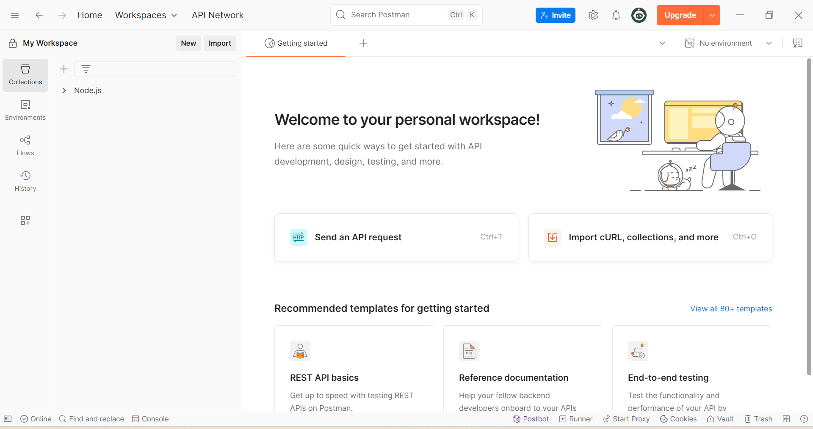
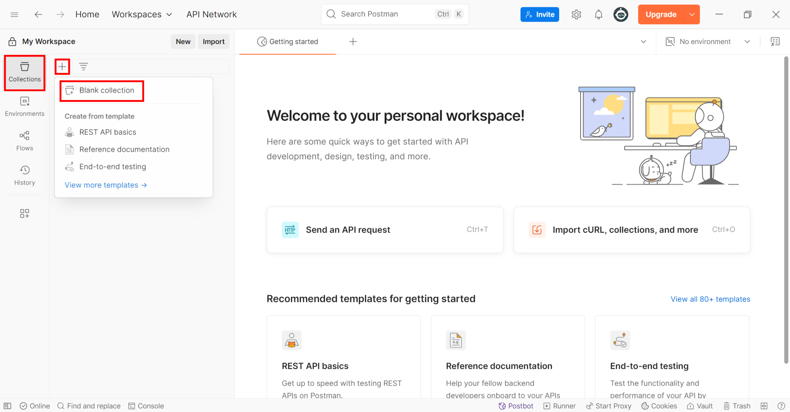
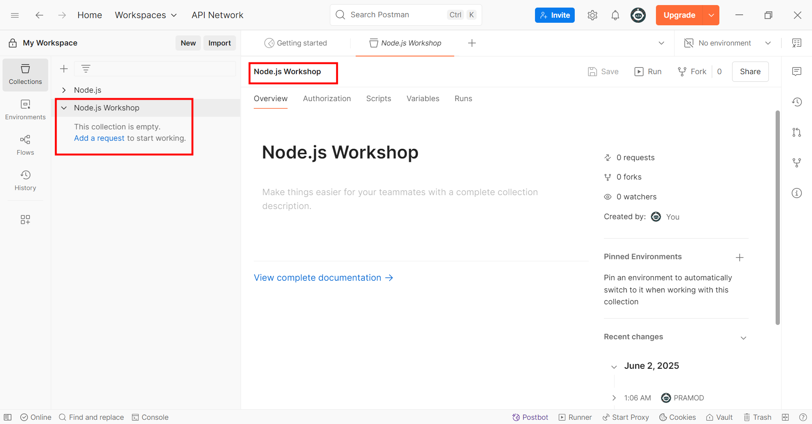
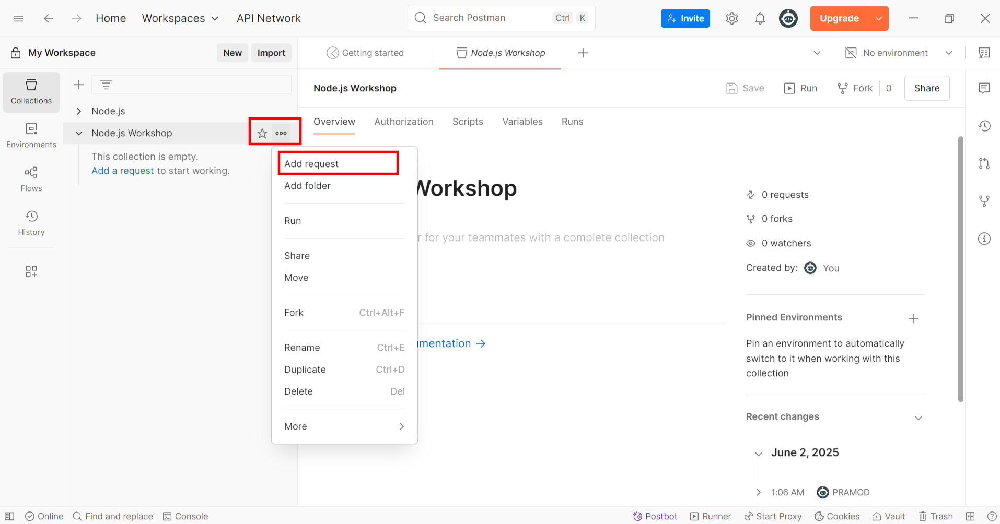
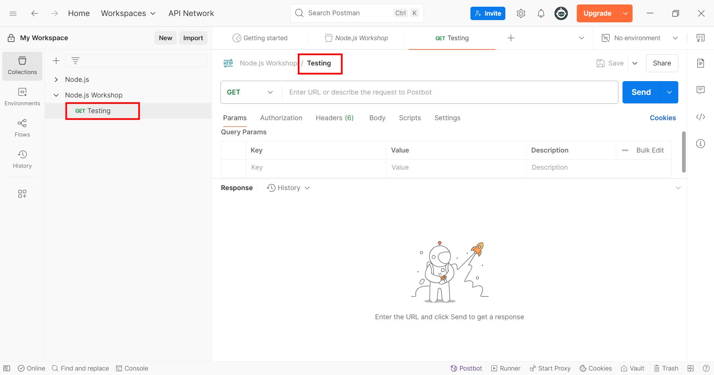
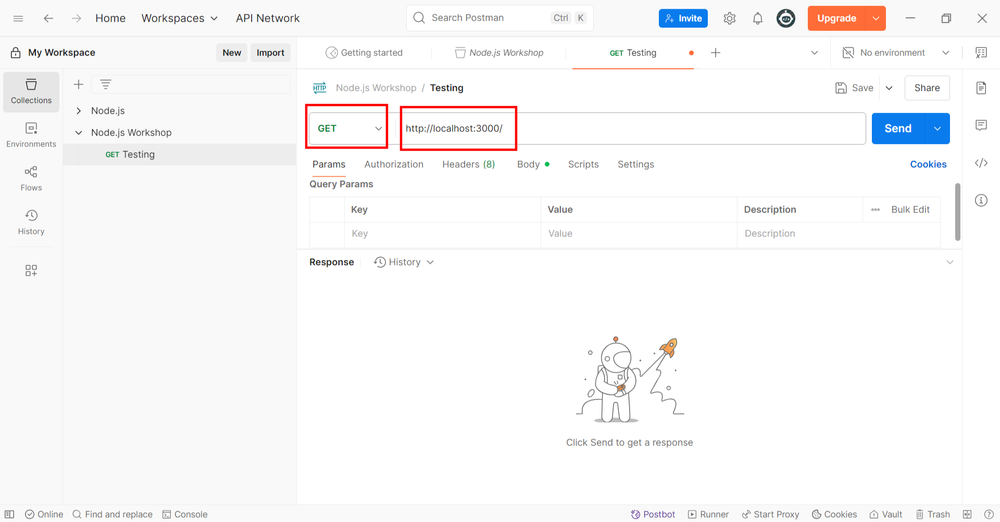
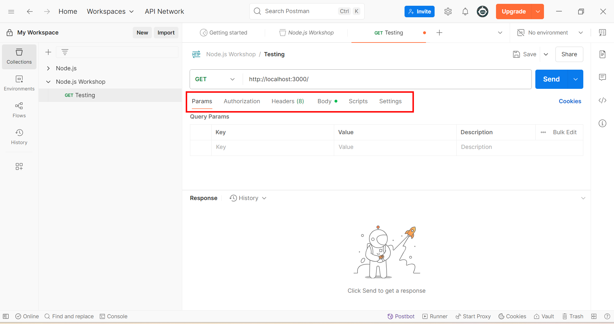
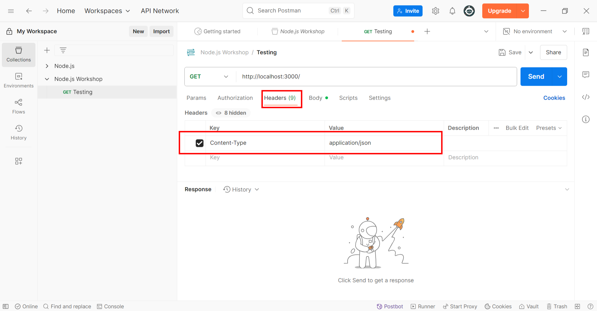
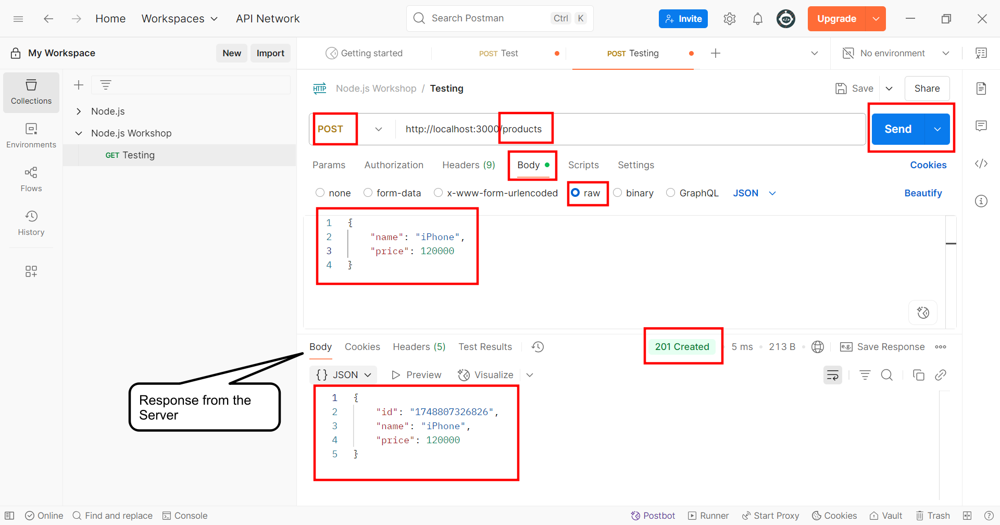

# 📘 How to Use Postman for API Testing
## 📌 What is Postman?
Postman is a **free API client** that helps developers `design`, `test`, and `document` APIs **faster and more efficiently.**

## Step-1: Open the Postman Application

 

## Step-2: Create New Collection

 

## Step-3: Rename the Collection

 

## Step-4: Add the HTTP Request

 

## Step-5: Rename the HTTP Request

 

## Step-6: Change the HTTP Method and the URL to send request to the Server

 

## Step-7: Checkout the Request Configureations Like: `Params`, `Authorization`, `Headers`, `Body`, ect

 

## Step-8: Most important Headers Configuration

 

## Step-9: POST HTTP method and /products endpoint with JSON Body and the Response from the Server
